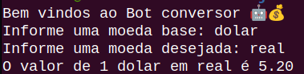

# Robô Conversor de Moedas

### Sobre o projeto

Este é um projeto que utiliza o Puppeteer para automatizar a tarefa de um conversor de moedas. O robô abre uma página no Google e efetua essa pesquisa.

### O que Puppeteer?

Puppeteer é uma biblioteca Node.js que fornece uma API de alto nível para controlar o Chrome ou o Chromium através do protocolo DevTools. Ele é frequentemente utilizado para automatizar tarefas de navegação na web.

*Se desejar rodar o projeto em sua máquina siga o passo a passo abaixo.*

### Pré-requisitos

1. Node 18+ ([Faça o donwload e instale](https://nodejs.org/en/download))

### Prepando o ambiente

1. Instale o Puppeteer  
`npm i puppeteer`  
2. Instale o readlineSync  
`npm i readline-sync`

### Para rodar o projeto:

No terminal digite:  
`node + nome do arquivo.js`

Exemplo de entrada de dados:

1. Digite a moeda base: dolar
2. Digite a moeda desejada: real

Pronto, veja o resultado.

#### O terminal deve mostrar:

Se dejesar voce também pode conferir o screnshot que é tirado na execução do código.

